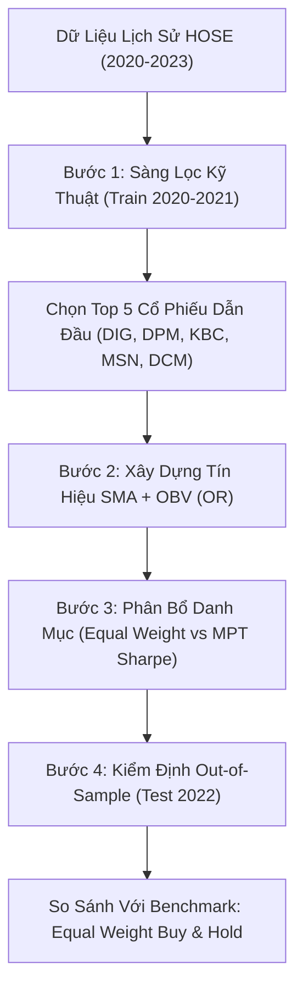

# 📈 Quantitative Trading Strategy Web App: SMA + OBV (OR) on HOSE

Ứng dụng web tương tác xây dựng trên nền tảng **Streamlit**, dùng để kiểm định (backtest) và trực quan hóa hiệu quả của chiến lược giao dịch định lượng kết hợp giữa tín hiệu **Xu hướng giá (SMA)** và **Dòng tiền khối lượng (OBV)** theo logic **HOẶC (OR)** trên dữ liệu các cổ phiếu niêm yết tại Sở Giao dịch Chứng khoán TP.HCM (HOSE).

---

## 🌟 Tính Năng Nổi Bật Của Web App

- **Sàng lọc Kỹ thuật Tự động (TA Screening)**: Tự động xếp hạng và chọn lọc cổ phiếu trên tập dữ liệu Train (2020–2021) dựa trên 4 trụ cột định lượng: Trend (30%), Momentum (25%), Volume (25%) và Risk (20%).
- **Trực quan hóa Tín hiệu Giao dịch Kỹ thuật**: Biểu đồ tương tác Plotly đa tầng (nến OHLCV, đường SMA ngắn/dài, các điểm đánh dấu tín hiệu MUA/BÁN, chỉ báo OBV và OBV-MA).
- **Tối ưu hóa Danh mục Đa tài sản**: So sánh phương pháp phân bổ **Đẳng trọng số (Equal Weight)** với **Lý thuyết Danh mục Hiện đại (Modern Portfolio Theory - MPT Markowitz)** tối đa hóa Sharpe Ratio.
- **Stress-Test Ngoài Mẫu (Out-of-sample 2022)**: Đánh giá độ bền bỉ của chiến lược trong giai đoạn thị trường gấu (Bear Market 2022) so với chuẩn so sánh Mua & Nắm giữ (Buy & Hold).
- **Phòng chống Thiên kiến Tương lai (Look-ahead Bias)**: Tín hiệu xuất hiện tại ngày $t$ chỉ được thực thi khớp lệnh tại phiên kế tiếp $t+1$.
- **Xuất Dữ liệu & Báo cáo**: Hỗ trợ tải về kết quả kiểm định, chuỗi tăng trưởng vốn hàng ngày và trọng số danh mục dưới định dạng CSV.

---

## 🏗️ Quy Trình Định Lượng 4 Bước



### 1. Logic Tín Hiệu SMA + OBV (OR)
- **Tín hiệu MUA (BUY = 1)**: Đường SMA ngắn cắt lên đường SMA dài **HOẶC** OBV cắt lên đường OBV-MA.
- **Tín hiệu BÁN (SELL = -1)**: Đường SMA ngắn cắt xuống đường SMA dài **HOẶC** OBV cắt xuống đường OBV-MA.
- **Xử lý mâu thuẫn**: Nếu trong cùng một phiên phát sinh đồng thời tín hiệu Mua và Bán từ 2 chỉ báo, hệ thống giữ vị thế trung lập (0) để tránh giao dịch nhiễu.

### 2. Kết Quả Thực Nghiệm Nổi Bật (Test 2022 - Downtrend)
| Chiến Lược / Danh Mục | Lợi Nhuận Tổng (Total Return) | Tỷ Suất Sinh Lời Năm | Sharpe Ratio | Mức Sụt Giảm Tối Đa (Max Drawdown) |
| :--- | :---: | :---: | :---: | :---: |
| **Equal Weight Buy & Hold** | **-50.41%** | -50.83% | -1.38 | -64.30% |
| **SMA + OBV (OR) Equal Weight** | **+5.63%** | +5.70% | +0.39 | **-19.25%** |
| **SMA + OBV (OR) MPT (Markowitz)** | **+7.00%** | +7.08% | **+0.41** | **-23.49%** |

> 📌 **Ý nghĩa thực tiễn**: Trong năm 2022 khi thị trường sụt giảm nghiêm trọng và chiến lược Mua & Nắm giữ mất hơn 50% giá trị, chiến lược SMA+OBV (OR) đã bảo vệ vốn thành công nhờ kịp thời chuyển sang tiền mặt khi gãy xu hướng và phân kỳ dòng tiền âm, đem lại tỷ suất lợi nhuận dương và hạn chế tối đa mức sụt giảm vốn.

---

## 📁 Cấu Trúc Thư Mục

```text
├── app.py                   # Mã nguồn ứng dụng web chính (Streamlit)
├── requirements.txt         # Danh sách thư viện Python cần thiết
├── README.md                # Tài liệu hướng dẫn sử dụng và triển khai
├── HOSE_2020_2023_in.csv    # Dữ liệu giá OHLCV lịch sử HOSE (2020-2023)
└── FINAL_NHOM_5.ipynb       # Jupyter Notebook gốc của nhóm nghiên cứu
```

---

## 💻 Hướng Dẫn Cài Đặt & Chạy Cục Bộ (Local)

### 1. Yêu Cầu Môi Trường
- Python 3.9, 3.10 hoặc 3.11.
- Git (để quản lý mã nguồn).

### 2. Các Bước Cài Đặt
```bash
# 1. Clone repository về máy tính
git clone https://github.com/<tai-khoan-cua-ban>/<ten-repo>.git
cd <ten-repo>

# 2. Khởi tạo và kích hoạt môi trường ảo (tùy chọn nhưng khuyến nghị)
python -m venv venv
# Trên Windows:
.\venv\Scripts\activate
# Trên Linux/macOS:
source venv/bin/activate

# 3. Cài đặt các thư viện cần thiết
pip install -r requirements.txt

# 4. Chạy ứng dụng Streamlit
streamlit run app.py
```
Sau khi chạy lệnh trên, trình duyệt web sẽ tự động mở địa chỉ: `http://localhost:8501`.

---

## 🚀 Hướng Dẫn Tải Lên GitHub & Deploy Trực Tuyến Lên Streamlit Cloud

### Bước 1: Khởi Tạo Kho Chứa Trên GitHub
1. Đăng nhập vào tài khoản [GitHub](https://github.com/).
2. Nhấn nút **New Repository** (hoặc `+` ở góc trên bên phải).
3. Đặt tên Repository (Ví dụ: `hose-quantitative-trading-app`).
4. Chọn chế độ **Public** (để có thể deploy miễn phí trên Streamlit Community Cloud) và nhấn **Create repository**.

### Bước 2: Đẩy Mã Nguồn Lên GitHub
Mở terminal/powershell tại thư mục dự án và thực thi chuỗi lệnh sau:
```bash
# Khởi tạo git repository
git init

# Thêm tất cả các file (app.py, requirements.txt, README.md, HOSE_2020_2023_in.csv)
git add app.py requirements.txt README.md HOSE_2020_2023_in.csv

# Tạo commit đầu tiên
git commit -m "feat: deploy streamlit quantitative trading web app"

# Đổi nhánh chính sang main
git branch -M main

# Liên kết với remote repository trên GitHub
git remote add origin https://github.com/<tai-khoan-cua-ban>/<ten-repo>.git

# Đẩy code lên GitHub
git push -u origin main
```

*(Lưu ý: File `HOSE_2020_2023_in.csv` có dung lượng ~5.7 MB, hoàn toàn nằm trong giới hạn 100 MB của GitHub nên có thể push trực tiếp bình thường).*

### Bước 3: Deploy Lên Streamlit Community Cloud
1. Truy cập vào [share.streamlit.io](https://share.streamlit.io/) và đăng nhập bằng tài khoản GitHub của bạn.
2. Nhấn nút **New app** (hoặc **Create app**).
3. Điền các thông tin:
   - **Repository**: Chọn repository bạn vừa đẩy lên (ví dụ: `<tai-khoan-cua-ban>/hose-quantitative-trading-app`).
   - **Branch**: `main`.
   - **Main file path**: `app.py`.
   - **App URL** (tùy chọn): Tùy chỉnh tên miền con miễn phí của bạn.
4. Nhấn **Deploy!**

Hệ thống của Streamlit sẽ tự động đọc file `requirements.txt`, cài đặt môi trường và khởi chạy ứng dụng web. Sau 1–2 phút, ứng dụng của bạn sẽ hoạt động trực tuyến với một đường link công khai để chia sẻ cho mọi người!

---

## 📊 Thư Viện Sử Dụng

- **Streamlit**: Xây dựng giao diện web ứng dụng định lượng tương tác.
- **Pandas & NumPy**: Xử lý dữ liệu bảng, chuỗi thời gian tài chính và tính toán đại số ma trận.
- **ta (Technical Analysis Library)**: Tính toán các chỉ báo kỹ thuật SMA, OBV chuẩn hóa.
- **SciPy (scipy.optimize.minimize - SLSQP)**: Tối ưu hóa phân bổ tỷ trọng danh mục Markowitz (MPT).
- **Plotly**: Vẽ biểu đồ kỹ thuật tương tác cao (Nến, đường tăng trưởng vốn, sụt giảm drawdown).

---

## 👥 Nhóm Tác Giả & Bản Quyền

- **Nhóm 5**: Dự án Kiểm định Chiến lược Định lượng & Tối ưu hóa Danh mục Đầu tư trên Thị trường Chứng khoán Việt Nam.
- Được cấp phép theo Giấy phép **MIT License**.
